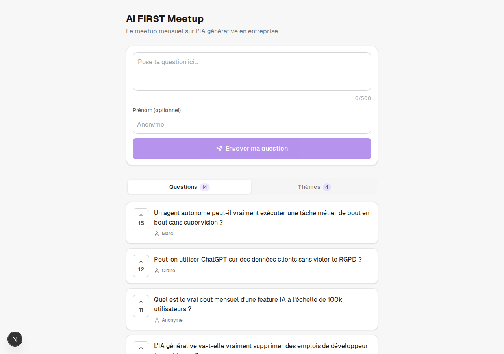
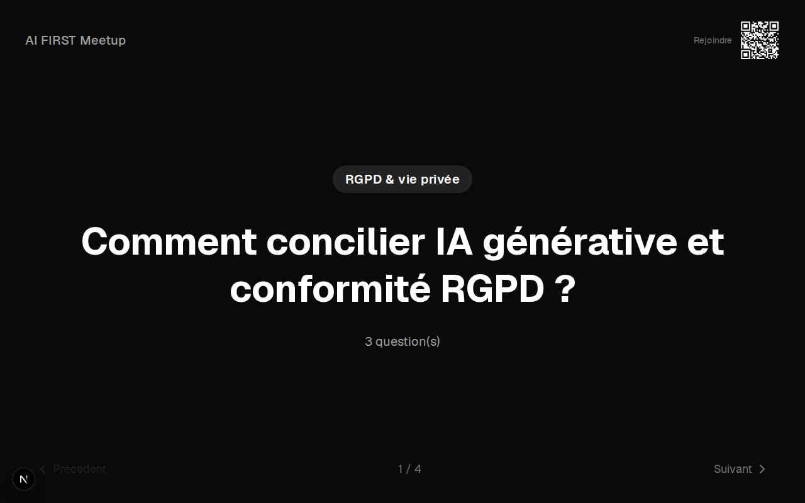

<div align="center">

# Wall

### The collaborative question wall for your events

Attendees post their questions from their phone via a QR code; the AI (Claude)
groups them into themes in near real time; the host runs the session from an
admin dashboard and displays a full-screen presenter mode.

[](https://nextjs.org)
[](https://www.typescriptlang.org)
[](https://www.prisma.io)
[](https://tailwindcss.com)
[](https://www.anthropic.com)

<br>

<table>
<tr>
<td width="50%"></td>
<td width="50%"></td>
</tr>
<tr>
<td align="center"><sub>Participant view</sub></td>
<td align="center"><sub>Wall mode (presenter)</sub></td>
</tr>
</table>

</div>

---

## Stack

- Next.js 16 (App Router) + TypeScript + Tailwind CSS 4
- Custom-built components (no heavy UI library) + `lucide-react` for icons
- Prisma 6 + PostgreSQL (Neon), same database in dev and prod
- `@anthropic-ai/sdk` (`claude-sonnet-4-6`) for clustering and rephrasing
- Real-time refresh via lightweight polling (4–5 s, `hooks/usePolling.ts`), no WebSocket
- `qrcode` for QR code generation, Zod for API input validation
- Duplicate/spam protection via a Postgres advisory lock (no external dependency
  like Redis, see "Security & Privacy")

---

## Setup

### 1. Environment variables

`.env.example` lists the two required variables. Next.js automatically loads
`.env` and `.env.local` (both ignored by git); you can split the values however
you like — by default the project is organized like this:

```bash
cp .env.example .env.local   # then remove ANTHROPIC_API_KEY from .env.local if you keep the key in .env
```

```env
# .env.local
DATABASE_URL="postgresql://..."   # a Postgres database (Neon, Supabase, Railway, etc.)

# .env
ANTHROPIC_API_KEY="sk-ant-..."
```

Without `ANTHROPIC_API_KEY`, the whole app works normally (submission, voting,
moderation, wall mode, exports). Only the "Cluster with AI" button will return
an explicit error (503).

### 2. Install and set up the database

```bash
npm install
npx prisma migrate dev   # applies the schema to the database pointed at by DATABASE_URL
npx prisma db seed       # demo event "AI FIRST Meetup" with ~15 questions
```

### 3. Start the dev server

```bash
npm run dev
```

Open [http://localhost:3000](http://localhost:3000).

### Deployment (Vercel)

- No `.env*` file is deployed (ignored by `.gitignore` and `.vercelignore`):
  configure `DATABASE_URL` and `ANTHROPIC_API_KEY` via `vercel env add` (or the
  dashboard) for Production, Preview, and Development.
- `package.json` has a `postinstall: prisma generate` script: without it, the
  build could reuse a Prisma Client cached from a previous deployment,
  generated against a different schema, and crash at runtime with a datasource
  validation error.
- The Postgres provider avoids the pitfall of serverless functions' ephemeral
  filesystem (SQLite doesn't work there).

---

## Demo walkthrough (5 steps)

The seed creates an `ai-first` event with a fixed admin token
(`demo-admin-token-do-not-use-in-prod`), handy for the demo, never to be used
in production (a real `POST /api/events` generates a random token).

1. **Participant**: open [http://localhost:3000/e/ai-first](http://localhost:3000/e/ai-first),
   post a question, upvote (▲) an existing question (click again to remove
   your vote). Post the exact same question again: it's rejected as a
   duplicate. "Themes" tab to see the groupings already in place.
2. **Admin**: open
   [http://localhost:3000/e/ai-first/admin?token=demo-admin-token-do-not-use-in-prod](http://localhost:3000/e/ai-first/admin?token=demo-admin-token-do-not-use-in-prod).
   The token is stored in a cookie: subsequent visits no longer need the
   `?token=` in the URL.
3. **Moderation**: approve the pending question, hide/unhide a question,
   reassign a question to another theme via the selector.
4. **AI clustering**: click "Cluster with AI" (requires
   `ANTHROPIC_API_KEY`): the 3 questions deliberately left ungrouped by the
   seed (jobs, skills, code review) get grouped into a new theme. Edit a
   group's label or synthesized question, reorder the themes.
5. **Wall mode**: open
   [http://localhost:3000/e/ai-first/wall](http://localhost:3000/e/ai-first/wall)
   in full screen (ideal on a second screen/projector). Navigate with
   `←`/`→`, press `Space` to mark the displayed theme as answered.

To finish: from the admin panel, export the data (Markdown or CSV), download
the participation QR code, or close submissions.

---

## Structure

```
app/
  page.tsx                     landing page (create / join an event)
  e/[slug]/page.tsx             participant page
  e/[slug]/wall/page.tsx        full-screen presenter mode
  e/[slug]/admin/page.tsx       organizer dashboard
  api/                          route handlers (events, questions, votes, groups, cluster, export)
hooks/
  usePolling.ts                 periodic client-side refresh (participant, admin, wall)
lib/
  clustering.ts                 Claude call + defensive parsing + transactional application
  export.ts                     Markdown and CSV export generation
  text.ts                       normalization for rejecting duplicate questions
  prisma.ts, validation.ts, admin-auth.ts, admin-request.ts, admin-client.ts,
  rate-limit.ts, slug.ts, client-storage.ts, types.ts
prisma/
  schema.prisma, seed.ts
components/
  ui/                           custom-built components (Button, Toggle, Tabs, Toast, EmptyState)
  participant/, admin/, landing/
```

---

## Security & Privacy

- No personal data required: first name optional, no email, no account.
- The anti-double-vote/anti-spam fingerprint is a random UUID stored in
  localStorage (no browser fingerprinting). It's compared/rate-limited
  server-side but never returned by the API: omitted by default at the Prisma
  client level (`lib/prisma.ts`), even on admin endpoints.
- The admin token is compared in constant time (`crypto.timingSafeEqual`) and
  is never returned by public endpoints.
- Duplicate-question detection and submission rate limiting (1 question / 30 s
  per device) rely on a Postgres advisory lock (`pg_advisory_xact_lock`, per
  event) rather than an in-memory mutex: correct even in a multi-instance
  serverless deployment (Vercel), not just single-instance. The vote rate
  limit (1 vote / s per question) stays in-memory per process — a simple UI
  debounce, with no reliability concern since a real double-vote is blocked
  anyway by a unique constraint in the database (`Vote.questionId +
  fingerprint`).
- Triggering AI clustering (`POST /api/events/[slug]/cluster`) is limited to
  1 call / 10 s per event (`lib/rate-limit.ts`): every call has a real cost
  (billed by Anthropic), unlike the other admin routes which only read/write
  to the database.
- Since the fingerprint is entirely client-supplied, these protections remain
  bypassable via a direct API call using a different fingerprint on each
  request. IP-based rate limiting was considered but dropped: at a meetup,
  many legitimate participants share the same IP (the room's Wi-Fi), which
  would create more false positives than real protection.
- Permanent deletion of an event (and all its data) is available from the
  admin panel.
